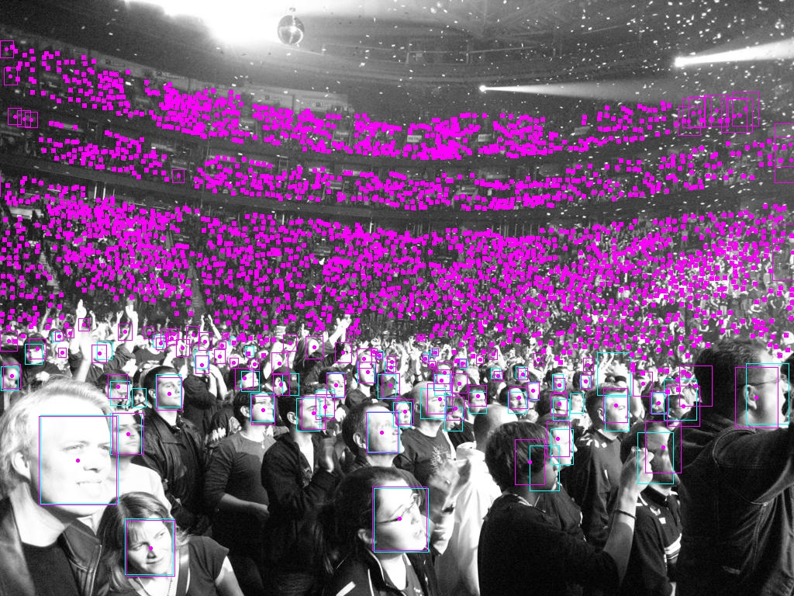
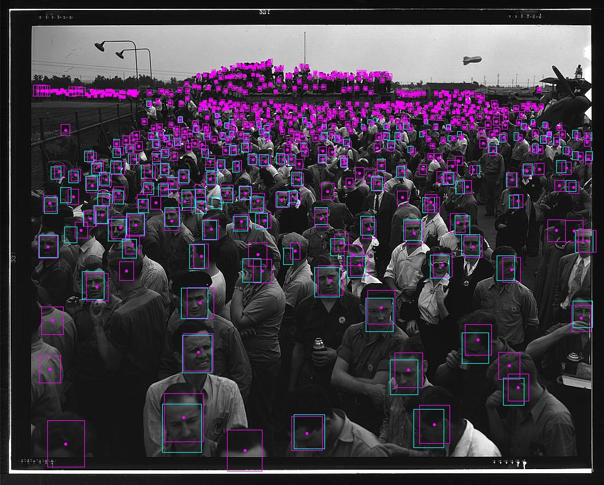

# Multi-Stream Networks and Ground-Truth Generation for Crowd Counting
Code of "Multi-Stream Networks and Ground-Truth Generation for Crowd Counting" presented in The International Journal of Electrical and Computer Engineering Systems 2020.





## 1. Environment

We used the following enviroment:

* Python 3
* PyTorch
* OpenCV
* Numpy
* MatPlotLib
* Ubuntu 16.04

You can also run the code using the docker image of [ufoym/deepo](https://hub.docker.com/r/ufoym/deepo).

To use ground truths generated by our `face` method, you have to install MXNET and other dependencias based on [this](https://github.com/chinakook/hr101_mxnet) repo.

## 2. Preparing data

We make available UCF-CC-50 and Shanghai Tech datasets [here](http://www.liv.ic.unicamp.br/~quispe/publications/data/data-crowd-counting.zip), download and unzip it into the root of the repo. Directories should have the following hierarchy:

```
ROOT_OF_REPO
    data
        ucf_cc_50
            UCF_CC_50
                images
                labels
        ShanghaiTech
            part_A
                train_data
                    images
                    ground-truth
                test_data
                    images
                    ground-truth
            part_B
                train_data
                    images
                    ground-truth
                test_data
                    images
                    ground-truth
```

The code was developed such that data augmentation is computed before every other step and the results are stored in the hard drive. Thus, the first time you run the code it will take quite a long time. Augmented data is stored with the following hierarchy:

```
ROOT_OF_REPO
    data
        ucf_cc_50
            people_thr_0_gt_mode_same
        ShanghaiTech
            part_A
                people_thr_0_gt_mode_same
            part_B
                people_thr_0_gt_mode_same
```

To run `face` method augmentation UCF-CC-50 dataset:

```bash
python3 tiny_detection_mxnet.py -d ucf-cc-50 --save-plots --root-dir YOUR-DATA-DIR
python3 main.py -d ucf-cc-50 --augment-only --force-augment --force-den-maps --gt-mode face
```

## 3. Training

To train using UCF-CC-50 (with all folds) and save the results log in `log/multi-stream` you can run:

```
python3 main.py -d ucf-cc-50 --train-batch 32 --save-dir log/multi-stream
```

In case you want to run a specific fold or part you can use flag `--units`, check the `Makefile` for more examples.

The training log is stored in `log_train.txt` inside the corresponding log/fold/part directory.

## 4. Testing

After training you can re-load the trained weights (using flag `--resume`) and use them for testing:

```
python3 main.py -d ucf-cc-50 --save-dir log/multi-stream --resume log/multi-stream/ucf-cc-50_people_thr_0_gt_mode_same --evaluate-only 
```

The testing log is stored in `log_test.txt` inside the corresponding log/fold/part directory. You can also generate the plots of the predictions using flag `--save-plots`, results are stored in the directory `plot-results-test` inside the corresponding log/fold/part directory.

## 5. Final Notes

If you have any question regarding the code or method don't hesitate to contact [me](https://github.com/RQuispeC). Further examples for running this code are available in the Makefile
